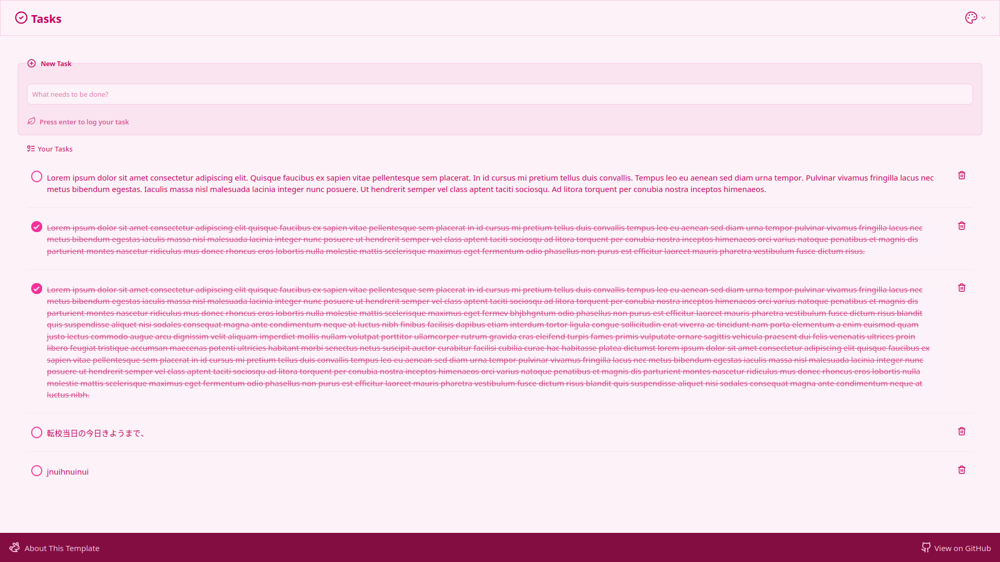
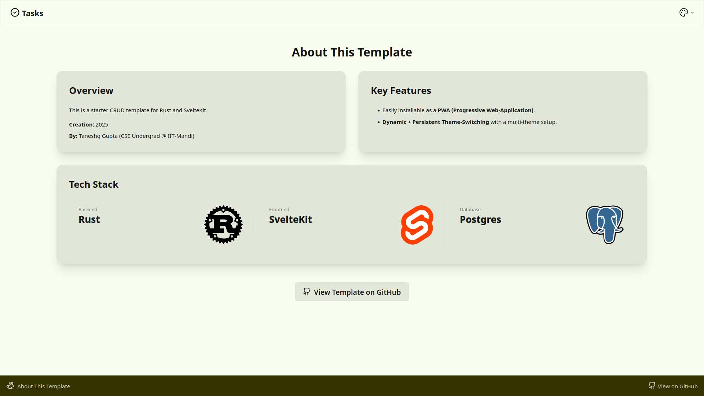
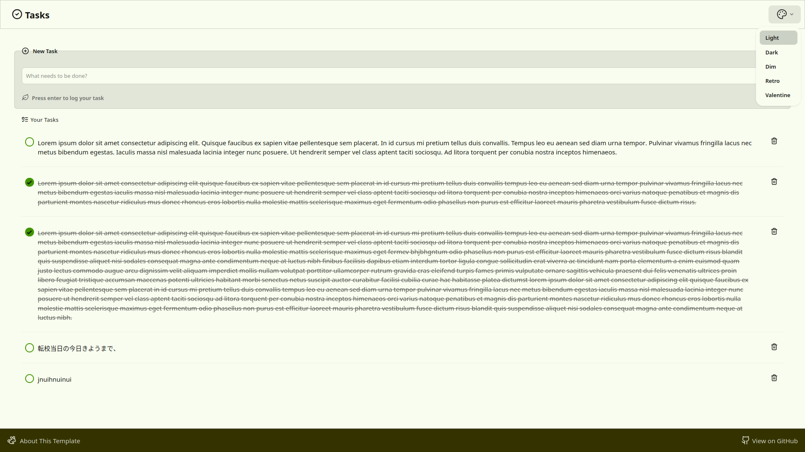
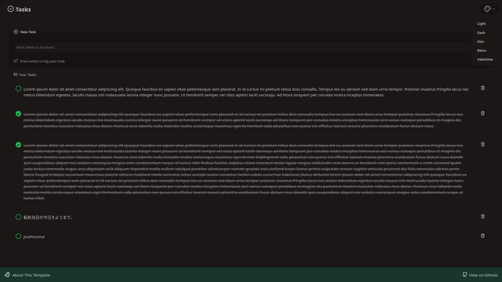
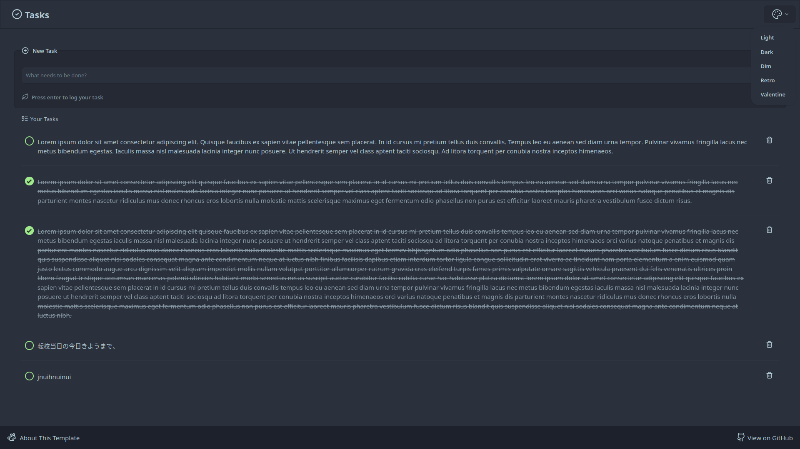
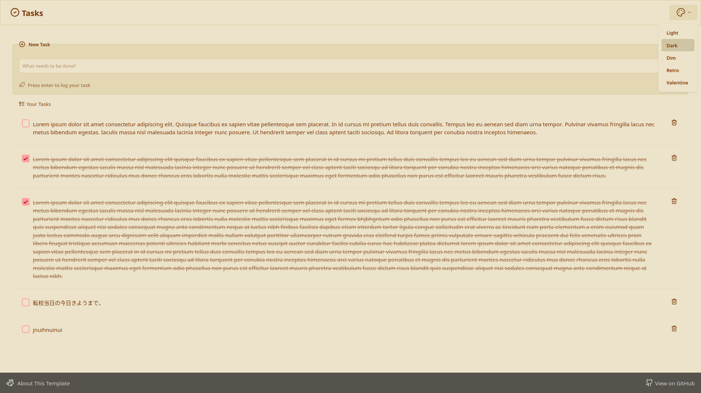

### Tasks 
#### This is a starter CRUD Web-App with Rustlang as Backend and SvelteKit as Frontend
#### Visit Now on [rust-svelte-tasks.taneshq.iitmandi.in.net](https://rust-svelte-tasks.taneshq.iitmandi.in.net)

###### Creation: 2025
###### By: Taneshq Gupta (CSE Undergrad @ IIT-Mandi)

##### Features:
  ###### Easily installable as a PWA (Progressive Web-Application). 
  ###### Dynamic + Persistent ThemeSwitching with multi-theme setup. 

##### Themes:
 ###### - Light
 
 
 
 ###### - Dark
 
 
 
 ###### - Dim
 
 
 
 ###### - Retro
 
 
 
 ###### - Valentine
 
 

##### Tech Stack:
  ###### Backend: Rust(Axum)
  ###### Frontend: Sveltekit
  ###### Database: Postgres
